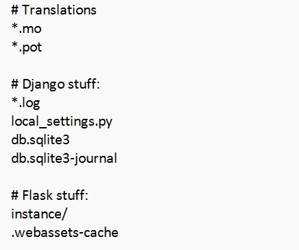

# Работа с Git
## 1. Проверка наличия установленного Git
В терминале выполнить команду `git --version`
Если git установлен, появится сообщение с информацией о версии программы. Или появится сообщение об ошибке.

## 2. Установка Git
Загружаем последнюю версию git [отсюда](https://git-scm.com/downloads).
Устанавливаем с настройками по умолчанию.

## 3. Настройка Git
При первом использовании git, необходимо представиться, для это нужно ввести в терминале две команды:
```bash
git config --global user.name "Ваше имя"
git config --global user.email "email@domain.com"
```

## 4. Создание репозитория
Создать репозиторий можно двумя способами:
1. В терминале переходим в папку, в которой хотим создать репозиторий. Выполняем команду:
```bash
git init
```
Данная команда инициализирует локальный репозиторий или превращает каталог, который в настоящее время не находится под версионным контролем в репозиторий Git.

2. Для клонирования существующего репозитория переходим в папку, в которой хотим создать репозиторий и выполняем команду:
```bash
git clone <url>
```
Здесь `url` - ссылка на внешний репозиторий.

## 5. Получение текущей информации о состоянии git
Для определения, какие файлы в каком состоянии находятся, выполняем команду:
```bash
git status
```
Если есть какие-либо изменения в каталоге, то команда их покажет:
```bash
On branch main
Changes not staged for commit:
  (use "git add <file>..." to update what will be committed)
  (use "git restore <file>..." to discard changes in working directory)
        modified:   git_instruction.md

no changes added to commit (use "git add" and/or "git commit -a")
```
Если таких изменений нет, то будет следующее сообщение:
```bash
On branch main
nothing to commit, working tree clean
```
У данной команды есть сокращенный вывод информации:
```bash
git status -s
```

## 6. Добавление под версионный контроль нового файла (файлов)
Для того чтобы добавить новый файл (файлы) в следующий коммит, используется команда:
```bash
git add <file>
```
Чтобы узнать, какой файл (файлы) необходимо добавить в коммит, воспользуйтесь командой `git status`. Инструкция по ее использованию смотрите в п. 5 данного руководства.
Если необходимо добавить в коммит все изменения в каталоге, воспользуйтесь командой:
```bash
git add .
```

## 7. Фиксация изменений (коммит)
Чтобы зафиксировать проиндексированные командой `git add <file>` изменения, воспользуйтесь командой:
```bash
git commit -m "Ваш комментарий к коммиту"
```
Можно объединить сразу две команды `add` и `commit` в одну:
```bash
git commit -am "Ваш комментарий к коммиту"
```
Но имейте ввиду, что в данном случае зафиксируются все изменения в один коммит, в том числе нежелательные.

*Запомните, что для всех файлов, созданных или изменённых вами, для которых вы не выполнили `git add` после редактирования — не войдут в коммит.*

## 8. Вывод на экран истории всех коммитов
Для просмотра истории коммитов (если она есть) запустите команду:
```bash
git log
```
По умолчанию команда перечисляет коммиты, сделанные в репозитории в обратном к хронологическому порядке — последние коммиты находятся вверху. Команда показывает коммиты с их хеш-кодами, именем и электронной почтой автора, датой создания и сообщением коммита.
У команды есть вывод информации в сокращенном виде:
```bash
git log --oneline
```

## 9. Переход от одного коммита к другому
Для перемещения между коммитами используется команда:
```bash
git checkout <hash>
```
Здесь `hash` - хеш-код коммита. Его можно получить с помощью команды `git log` (п. 8 данного руководства).
Для возврата к актуальному состоянию работы с проектом воспользуйтесь командой:
```bash
git checkout main
```
или
```bash
git switch -
```
*Важно помнить, что `git checkout <hash>` опасная команда. В обязательном порядке возвращайтесь к актуальному состоянию работы с проектом, кроме случаев, когда вы возвращаетесь к определенному коммиту осознано.*

## 10. Сравнение изменений
Для просмотра изменений в файлах запустите команду:
```bash
git diff
```
Вывод команды показывает добавленные и удаленные строки.
Изменения в отдельном файле можно посмотреть командой:
```bash
git diff <file>
```

## 11. Игнорирование файлов
Git рассматривает каждый файл в вашей рабочей копии как файл одного из трех типов: отслеживаемый файл — файл, который был предварительно проиндексирован или зафиксирован в коммите, неотслеживаемый файл — файл, который не был проиндексирован или зафиксирован в коммите и игнорируемый файл — файл, явным образом помеченный для Git как файл, который необходимо игнорировать. 

Игнорируемые файлы — это файлы, которые по какой-либо причине не должны попадать в коммиты. Например:
* кэши зависимостей;
* скомпилированный код;
* каталоги для выходных данных сборки;
* файлы, сгенерированные во время выполнения;
* скрытые системные файлы;
* личные файлы конфигурации IDE и другое.

Игнорируемые файлы отслеживаются в специальном файле .gitignore. Его необходимо создать в корневом каталоге репозитория, затем вручную отредактировать файл, указав в нем новые файлы, которые должны быть проигнорированы. Например, ниже на картинке показана часть шаблона .gitignore для python проекта.

В файле можно укзаать конкректный файл или каталог, все файлы с определенным расширением, например `*.log` и т.д.

## Заключение
 ***В процессе разработки ПО значимая роль отводится сотрудничеству. В большинстве случаев деятельность разработчика включает работу в команде и совместное использование проекта с другими специалистами. Практический опыт использования системы контроля версий не просто важен, а ВАЖЕН для всех, кто намерен заниматься разработкой ПО.*** 